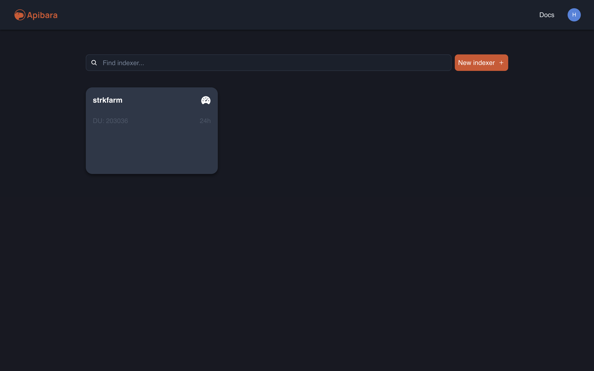
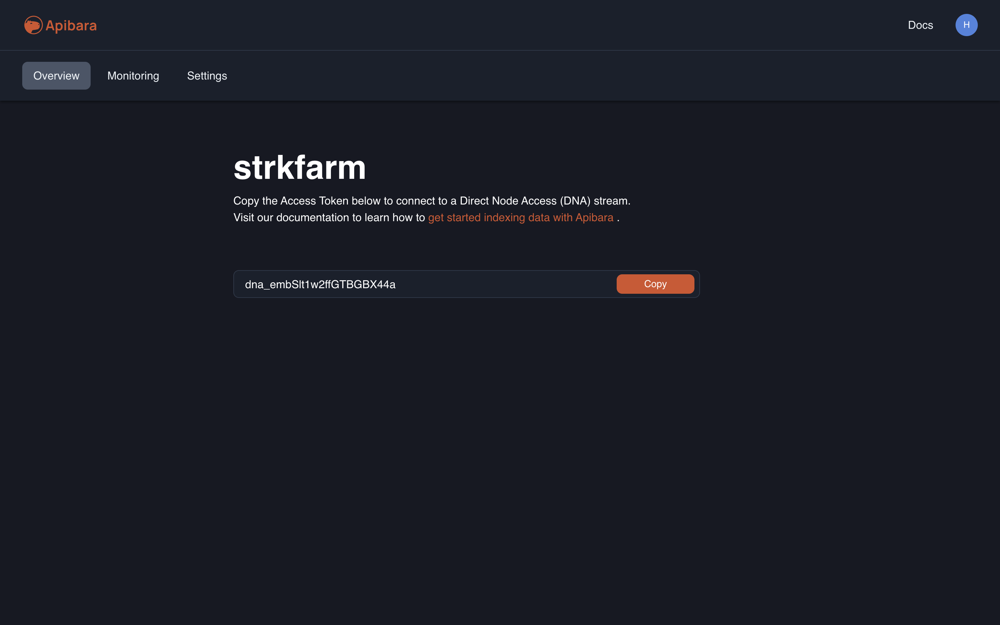
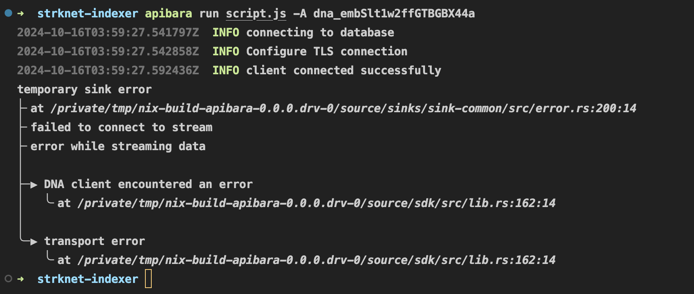

## `apibara run script.js -A dna_embSlt1w2ffGTBGBX44a` -> cmd to run the script.js file with the ```dna_embSlt1w2ffGTBGBX44a``` API key

- This API key can be get from '*<https://app.apibara.com>*' by creating an indexer and getting the API key from the overview tab.
  
  

`script.js` is a separate file that contains the code that you want to run. It can be a simple script or a complex one.

Need to install supabase cli from *<https://supabase.com/docs/guides/local-development/cli/getting-started>* and all the supabase cmds is also in this link.

- `supabase init`
- `supabase migration new add_tables`
- then write the sql query in the sql file under migrations dir that is created after running the above cmd

```sql

CREATE TABLE IF NOT EXISTS transactions (
    block_number BIGINT,
    transaction_hash TEXT,
    transaction_index INTEGER,
    sender_address TEXT,

    -- _cursor bigint is mandaotry field for apibara 
    _cursor BIGINT, 
    PRIMARY KEY (block_number, transaction_hash)
);

```

- `supabase migration up`
- `supabase start`
- `supabase status`
- `supabase stop`
- docker daemon must be running

Right now i'm getting some strange error while running the `script.js` file with `apibara`, didn't get any solution for this in docs or on google. The error is:


## random video resource - *<https://www.youtube.com/watch?v=XCxAvuutks4>*
